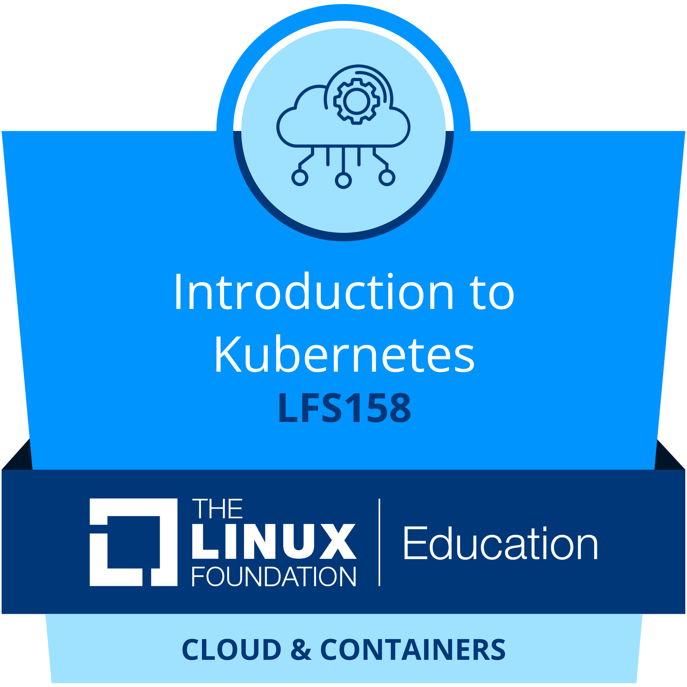

## Introduction

Hello and welcome to my GitHub page!

I am an ambitious and hardworking programmer with a Bachelor's degree in Computer Science, achieving excellent grades. I am already familiar with Go, SQL, Python, Rust, C++, and Java, and I have been programming since middle school. I am also comfortable with Linux, Shell scripts, Git, CI/CD, and Kubernetes. So far, I have had two years of work experience as a software tester. I love challenging tasks that teach me new things, but I am also resilient enough to complete those that are not enjoyable.

## My Credly Badges

<!--
**Gandook/Gandook** is a ✨ _special_ ✨ repository because its `README.md` (this file) appears on your GitHub profile.

Here are some ideas to get you started:

- 🔭 I’m currently working on ...
- 🌱 I’m currently learning ...
- 👯 I’m looking to collaborate on ...
- 🤔 I’m looking for help with ...
- 💬 Ask me about ...
- 📫 How to reach me: ...
- 😄 Pronouns: ...
- ⚡ Fun fact: ...
-->
